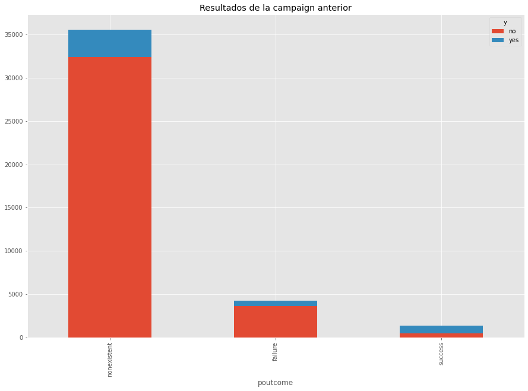

# K-Nearest Neighbours:
El algoritmo flojo, Instance based learning.

Se recomienda usar un k impar.

Tiende a necesitar reduccion de dimensionalidad.

* Distancia de Minkowski:Minkowski distance is a metric in Normed vector space. What is Normed vector space? A Normed vector space is a vector space on which a norm is defined. Suppose X is a vector space then a norm on X is a real valued function ||x||which satisfies below conditions.
    * p = 1, Manhattan Distance
    * p = 2, Euclidean Distance
    * p = ∞, Chebychev Distance

* Distancia de Manhattan: The distance between two points is the sum of the absolute differences of their Cartesian coordinates. The geometry has been used in regression analysis since the 18th century, and today is often referred to as LASSO.  

* Distancia Euclidiana o de Manhattan: En matemáticas, la distancia euclidiana o euclídea, es la distancia "ordinaria" entre dos puntos de un espacio euclídeo, la cual se deduce a partir del teorema de Pitágoras. Por ejemplo, en un espacio bidimensional, la distancia euclidiana entre dos puntos P1 y P2, de coordenadas cartesianas (x1, y1) y (x2, y2) respectivamente.

* Chebyshev distance: In mathematics, Chebyshev distance (or Tchebychev distance), maximum metric, or L∞ metric[1] is a metric defined on a vector space where the distance between two vectors is the greatest of their differences along any coordinate dimension.[2] It is named after Pafnuty Chebyshev. It is also known as chessboard distance, since in the game of chess the minimum number of moves needed by a king to go from one square on a chessboard to another equals the Chebyshev distance between the centers of the squares, if the squares have side length one, as represented in 2-D spatial coordinates with axes aligned to the edges of the board.[3] For example, the Chebyshev distance between f6 and e2 equals 4.


* NOTES: In chess, the distance between squares on the chessboard for rooks is measured in taxicab distance; kings and queens use Chebyshev distance, and bishops use the taxicab distance (between squares of the same color) on the chessboard rotated 45 degrees, i.e., with its diagonals as coordinate axes. To reach from one square to another, only kings require the number of moves equal to their respective distance; rooks, queens and bishops require one or two moves (on an empty board, and assuming that the move is possible at all in the bishop's case).

# Random Forest Classifier
Is a flexible, easy to use machine learning algorithm that produces, even without hyper-parameter tuning, a great result most of the time. It is also one of the most used algorithms, because of its simplicity and diversity (it can be used for both classification and regression tasks). 

Random forest is a supervised learning algorithm. The "forest" it builds, is an ensemble of decision trees, usually trained with the “bagging” method. The general idea of the bagging method is that a combination of learning models increases the overall result.

Random forest adds additional randomness to the model, while growing the trees. Instead of searching for the most important feature while splitting a node, it searches for the best feature among a random subset of features. This results in a wide diversity that generally results in a better model.

Therefore, in random forest, only a random subset of the features is taken into consideration by the algorithm for splitting a node. You can even make trees more random by additionally using random thresholds for each feature rather than searching for the best possible thresholds (like a normal decision tree does).

While random forest is a collection of decision trees, there are some differences.

If you input a training dataset with features and labels into a decision tree, it will formulate some set of rules, which will be used to make the predictions.

For example, to predict whether a person will click on an online advertisement, you might collect the ads the person clicked on in the past and some features that describe his/her decision. If you put the features and labels into a decision tree, it will generate some rules that help predict whether the advertisement will be clicked or not. In comparison, the random forest algorithm randomly selects observations and features to build several decision trees and then averages the results.

Another difference is "deep" decision trees might suffer from overfitting. Most of the time, random forest prevents this by creating random subsets of the features and building smaller trees using those subsets. Afterwards, it combines the subtrees. It's important to note this doesn’t work every time and it also makes the computation slower, depending on how many trees the random forest builds.

The hyperparameters in random forest are either used to increase the predictive power of the model or to make the model faster. Let's look at the hyperparameters of sklearns built-in random forest function.

1. Increasing the predictive power

Firstly, there is the n_estimators hyperparameter, which is just the number of trees the algorithm builds before taking the maximum voting or taking the averages of predictions. In general, a higher number of trees increases the performance and makes the predictions more stable, but it also slows down the computation.

Another important hyperparameter is max_features, which is the maximum number of features random forest considers to split a node. Sklearn provides several options, all described in the documentation.

The last important hyperparameter is min_sample_leaf. This determines the minimum number of leafs required to split an internal node.

2. Increasing the model's speed

The n_jobs hyperparameter tells the engine how many processors it is allowed to use. If it has a value of one, it can only use one processor. A value of “-1” means that there is no limit.

The random_state hyperparameter makes the model’s output replicable. The model will always produce the same results when it has a definite value of random_state and if it has been given the same hyperparameters and the same training data.

Lastly, there is the oob_score (also called oob sampling), which is a random forest cross-validation method. In this sampling, about one-third of the data is not used to train the model and can be used to evaluate its performance. These samples are called the out-of-bag samples. It's very similar to the leave-one-out-cross-validation method, but almost no additional computational burden goes along with it.


```python
from sklearn.model_selection import train_test_split
from sklearn.preprocessing import StandardScaler
from sklearn.neighbors import KNeighborsClassifier
from mlxtend.plotting import plot_decision_regions
import matplotlib.pyplot as plt
import pandas as pd

from sklearn.feature_selection import SelectKBest
from sklearn.feature_selection import chi2
from sklearn.feature_selection import f_classif
from sklearn.preprocessing import LabelEncoder
from sklearn.model_selection import train_test_split
from sklearn.ensemble import RandomForestClassifier
from sklearn.model_selection import StratifiedKFold, cross_val_score
from sklearn.metrics import confusion_matrix,accuracy_score,classification_report
pd.set_option('display.max_columns', 50)

import seaborn as sns
import numpy as np
plt.style.use('ggplot')
```


```python
!ls
```

    'DATADICT BANK MARKETING'   bank-additional-full.csv
    'KNN EXAMPLE.ipynb'	    bank-additional-full.csv.zip
    'KNN Portfolio.ipynb'	    funnelFinal.csv


```python
df = pd.read_csv('bank-additional-full.csv', sep=';')
```


```python
df.head()
```


<div>
<style scoped>
    .dataframe tbody tr th:only-of-type {
        vertical-align: middle;
    }

    .dataframe tbody tr th {
        vertical-align: top;
    }

    .dataframe thead th {
        text-align: right;
    }
</style>
<table border="1" class="dataframe">
  <thead>
    <tr style="text-align: right;">
      <th></th>
      <th>age</th>
      <th>job</th>
      <th>marital</th>
      <th>education</th>
      <th>default</th>
      <th>housing</th>
      <th>loan</th>
      <th>contact</th>
      <th>month</th>
      <th>day_of_week</th>
      <th>duration</th>
      <th>campaign</th>
      <th>pdays</th>
      <th>previous</th>
      <th>poutcome</th>
      <th>emp.var.rate</th>
      <th>cons.price.idx</th>
      <th>cons.conf.idx</th>
      <th>euribor3m</th>
      <th>nr.employed</th>
      <th>y</th>
    </tr>
  </thead>
  <tbody>
    <tr>
      <th>0</th>
      <td>56</td>
      <td>housemaid</td>
      <td>married</td>
      <td>basic.4y</td>
      <td>no</td>
      <td>no</td>
      <td>no</td>
      <td>telephone</td>
      <td>may</td>
      <td>mon</td>
      <td>261</td>
      <td>1</td>
      <td>999</td>
      <td>0</td>
      <td>nonexistent</td>
      <td>1.1</td>
      <td>93.994</td>
      <td>-36.4</td>
      <td>4.857</td>
      <td>5191.0</td>
      <td>no</td>
    </tr>
    <tr>
      <th>1</th>
      <td>57</td>
      <td>services</td>
      <td>married</td>
      <td>high.school</td>
      <td>unknown</td>
      <td>no</td>
      <td>no</td>
      <td>telephone</td>
      <td>may</td>
      <td>mon</td>
      <td>149</td>
      <td>1</td>
      <td>999</td>
      <td>0</td>
      <td>nonexistent</td>
      <td>1.1</td>
      <td>93.994</td>
      <td>-36.4</td>
      <td>4.857</td>
      <td>5191.0</td>
      <td>no</td>
    </tr>
    <tr>
      <th>2</th>
      <td>37</td>
      <td>services</td>
      <td>married</td>
      <td>high.school</td>
      <td>no</td>
      <td>yes</td>
      <td>no</td>
      <td>telephone</td>
      <td>may</td>
      <td>mon</td>
      <td>226</td>
      <td>1</td>
      <td>999</td>
      <td>0</td>
      <td>nonexistent</td>
      <td>1.1</td>
      <td>93.994</td>
      <td>-36.4</td>
      <td>4.857</td>
      <td>5191.0</td>
      <td>no</td>
    </tr>
    <tr>
      <th>3</th>
      <td>40</td>
      <td>admin.</td>
      <td>married</td>
      <td>basic.6y</td>
      <td>no</td>
      <td>no</td>
      <td>no</td>
      <td>telephone</td>
      <td>may</td>
      <td>mon</td>
      <td>151</td>
      <td>1</td>
      <td>999</td>
      <td>0</td>
      <td>nonexistent</td>
      <td>1.1</td>
      <td>93.994</td>
      <td>-36.4</td>
      <td>4.857</td>
      <td>5191.0</td>
      <td>no</td>
    </tr>
    <tr>
      <th>4</th>
      <td>56</td>
      <td>services</td>
      <td>married</td>
      <td>high.school</td>
      <td>no</td>
      <td>no</td>
      <td>yes</td>
      <td>telephone</td>
      <td>may</td>
      <td>mon</td>
      <td>307</td>
      <td>1</td>
      <td>999</td>
      <td>0</td>
      <td>nonexistent</td>
      <td>1.1</td>
      <td>93.994</td>
      <td>-36.4</td>
      <td>4.857</td>
      <td>5191.0</td>
      <td>no</td>
    </tr>
  </tbody>
</table>
</div>


## Exploratory Data Analysis


```python
list(df.columns)
```


    ['age',
     'job',
     'marital',
     'education',
     'default',
     'housing',
     'loan',
     'contact',
     'month',
     'day_of_week',
     'duration',
     'campaign',
     'pdays',
     'previous',
     'poutcome',
     'emp.var.rate',
     'cons.price.idx',
     'cons.conf.idx',
     'euribor3m',
     'nr.employed',
     'y']


```python
df.info()
```

    <class 'pandas.core.frame.DataFrame'>
    RangeIndex: 41188 entries, 0 to 41187
    Data columns (total 21 columns):
     #   Column          Non-Null Count  Dtype  
    ---  ------          --------------  -----  
     0   age             41188 non-null  int64  
     1   job             41188 non-null  object 
     2   marital         41188 non-null  object 
     3   education       41188 non-null  object 
     4   default         41188 non-null  object 
     5   housing         41188 non-null  object 
     6   loan            41188 non-null  object 
     7   contact         41188 non-null  object 
     8   month           41188 non-null  object 
     9   day_of_week     41188 non-null  object 
     10  duration        41188 non-null  int64  
     11  campaign        41188 non-null  int64  
     12  pdays           41188 non-null  int64  
     13  previous        41188 non-null  int64  
     14  poutcome        41188 non-null  object 
     15  emp.var.rate    41188 non-null  float64
     16  cons.price.idx  41188 non-null  float64
     17  cons.conf.idx   41188 non-null  float64
     18  euribor3m       41188 non-null  float64
     19  nr.employed     41188 non-null  float64
     20  y               41188 non-null  object 
    dtypes: float64(5), int64(5), object(11)
    memory usage: 6.6+ MB


```python
round(df.describe(),2)
```


<div>
<style scoped>
    .dataframe tbody tr th:only-of-type {
        vertical-align: middle;
    }

    .dataframe tbody tr th {
        vertical-align: top;
    }

    .dataframe thead th {
        text-align: right;
    }
</style>
<table border="1" class="dataframe">
  <thead>
    <tr style="text-align: right;">
      <th></th>
      <th>age</th>
      <th>duration</th>
      <th>campaign</th>
      <th>pdays</th>
      <th>previous</th>
      <th>emp.var.rate</th>
      <th>cons.price.idx</th>
      <th>cons.conf.idx</th>
      <th>euribor3m</th>
      <th>nr.employed</th>
    </tr>
  </thead>
  <tbody>
    <tr>
      <th>count</th>
      <td>41188.00</td>
      <td>41188.00</td>
      <td>41188.00</td>
      <td>41188.00</td>
      <td>41188.00</td>
      <td>41188.00</td>
      <td>41188.00</td>
      <td>41188.00</td>
      <td>41188.00</td>
      <td>41188.00</td>
    </tr>
    <tr>
      <th>mean</th>
      <td>40.02</td>
      <td>258.29</td>
      <td>2.57</td>
      <td>962.48</td>
      <td>0.17</td>
      <td>0.08</td>
      <td>93.58</td>
      <td>-40.50</td>
      <td>3.62</td>
      <td>5167.04</td>
    </tr>
    <tr>
      <th>std</th>
      <td>10.42</td>
      <td>259.28</td>
      <td>2.77</td>
      <td>186.91</td>
      <td>0.49</td>
      <td>1.57</td>
      <td>0.58</td>
      <td>4.63</td>
      <td>1.73</td>
      <td>72.25</td>
    </tr>
    <tr>
      <th>min</th>
      <td>17.00</td>
      <td>0.00</td>
      <td>1.00</td>
      <td>0.00</td>
      <td>0.00</td>
      <td>-3.40</td>
      <td>92.20</td>
      <td>-50.80</td>
      <td>0.63</td>
      <td>4963.60</td>
    </tr>
    <tr>
      <th>25%</th>
      <td>32.00</td>
      <td>102.00</td>
      <td>1.00</td>
      <td>999.00</td>
      <td>0.00</td>
      <td>-1.80</td>
      <td>93.08</td>
      <td>-42.70</td>
      <td>1.34</td>
      <td>5099.10</td>
    </tr>
    <tr>
      <th>50%</th>
      <td>38.00</td>
      <td>180.00</td>
      <td>2.00</td>
      <td>999.00</td>
      <td>0.00</td>
      <td>1.10</td>
      <td>93.75</td>
      <td>-41.80</td>
      <td>4.86</td>
      <td>5191.00</td>
    </tr>
    <tr>
      <th>75%</th>
      <td>47.00</td>
      <td>319.00</td>
      <td>3.00</td>
      <td>999.00</td>
      <td>0.00</td>
      <td>1.40</td>
      <td>93.99</td>
      <td>-36.40</td>
      <td>4.96</td>
      <td>5228.10</td>
    </tr>
    <tr>
      <th>max</th>
      <td>98.00</td>
      <td>4918.00</td>
      <td>56.00</td>
      <td>999.00</td>
      <td>7.00</td>
      <td>1.40</td>
      <td>94.77</td>
      <td>-26.90</td>
      <td>5.04</td>
      <td>5228.10</td>
    </tr>
  </tbody>
</table>
</div>


```python
piv = pd.pivot_table(df, columns='education',index='job',aggfunc='count',values='age')
piv.plot(kind='bar', stacked=True, figsize=(15,10))
plt.title('Gente en cada trabajo dividida por nivel de educacion')
plt.ylabel('Total')
plt.xlabel('Trabajo')
```


    Text(0.5, 0, 'Trabajo')


```python
piv
```


<div>
<style scoped>
    .dataframe tbody tr th:only-of-type {
        vertical-align: middle;
    }

    .dataframe tbody tr th {
        vertical-align: top;
    }

    .dataframe thead th {
        text-align: right;
    }
</style>
<table border="1" class="dataframe">
  <thead>
    <tr style="text-align: right;">
      <th>education</th>
      <th>basic.4y</th>
      <th>basic.6y</th>
      <th>basic.9y</th>
      <th>high.school</th>
      <th>illiterate</th>
      <th>professional.course</th>
      <th>university.degree</th>
      <th>unknown</th>
    </tr>
    <tr>
      <th>job</th>
      <th></th>
      <th></th>
      <th></th>
      <th></th>
      <th></th>
      <th></th>
      <th></th>
      <th></th>
    </tr>
  </thead>
  <tbody>
    <tr>
      <th>admin.</th>
      <td>77.0</td>
      <td>151.0</td>
      <td>499.0</td>
      <td>3329.0</td>
      <td>1.0</td>
      <td>363.0</td>
      <td>5753.0</td>
      <td>249.0</td>
    </tr>
    <tr>
      <th>blue-collar</th>
      <td>2318.0</td>
      <td>1426.0</td>
      <td>3623.0</td>
      <td>878.0</td>
      <td>8.0</td>
      <td>453.0</td>
      <td>94.0</td>
      <td>454.0</td>
    </tr>
    <tr>
      <th>entrepreneur</th>
      <td>137.0</td>
      <td>71.0</td>
      <td>210.0</td>
      <td>234.0</td>
      <td>2.0</td>
      <td>135.0</td>
      <td>610.0</td>
      <td>57.0</td>
    </tr>
    <tr>
      <th>housemaid</th>
      <td>474.0</td>
      <td>77.0</td>
      <td>94.0</td>
      <td>174.0</td>
      <td>1.0</td>
      <td>59.0</td>
      <td>139.0</td>
      <td>42.0</td>
    </tr>
    <tr>
      <th>management</th>
      <td>100.0</td>
      <td>85.0</td>
      <td>166.0</td>
      <td>298.0</td>
      <td>NaN</td>
      <td>89.0</td>
      <td>2063.0</td>
      <td>123.0</td>
    </tr>
    <tr>
      <th>retired</th>
      <td>597.0</td>
      <td>75.0</td>
      <td>145.0</td>
      <td>276.0</td>
      <td>3.0</td>
      <td>241.0</td>
      <td>285.0</td>
      <td>98.0</td>
    </tr>
    <tr>
      <th>self-employed</th>
      <td>93.0</td>
      <td>25.0</td>
      <td>220.0</td>
      <td>118.0</td>
      <td>3.0</td>
      <td>168.0</td>
      <td>765.0</td>
      <td>29.0</td>
    </tr>
    <tr>
      <th>services</th>
      <td>132.0</td>
      <td>226.0</td>
      <td>388.0</td>
      <td>2682.0</td>
      <td>NaN</td>
      <td>218.0</td>
      <td>173.0</td>
      <td>150.0</td>
    </tr>
    <tr>
      <th>student</th>
      <td>26.0</td>
      <td>13.0</td>
      <td>99.0</td>
      <td>357.0</td>
      <td>NaN</td>
      <td>43.0</td>
      <td>170.0</td>
      <td>167.0</td>
    </tr>
    <tr>
      <th>technician</th>
      <td>58.0</td>
      <td>87.0</td>
      <td>384.0</td>
      <td>873.0</td>
      <td>NaN</td>
      <td>3320.0</td>
      <td>1809.0</td>
      <td>212.0</td>
    </tr>
    <tr>
      <th>unemployed</th>
      <td>112.0</td>
      <td>34.0</td>
      <td>186.0</td>
      <td>259.0</td>
      <td>NaN</td>
      <td>142.0</td>
      <td>262.0</td>
      <td>19.0</td>
    </tr>
    <tr>
      <th>unknown</th>
      <td>52.0</td>
      <td>22.0</td>
      <td>31.0</td>
      <td>37.0</td>
      <td>NaN</td>
      <td>12.0</td>
      <td>45.0</td>
      <td>131.0</td>
    </tr>
  </tbody>
</table>
</div>


```python
pd.pivot_table(df, columns='loan', index='job', aggfunc='count', values='age').plot(kind='bar', stacked = True, figsize=(15,5))
```


    <AxesSubplot:xlabel='job'>


```python
sns.countplot(df['housing'], order = ['yes','no','unknown'])
```

    /home/jp/snap/jupyter/common/lib/python3.7/site-packages/seaborn/_decorators.py:43: FutureWarning: Pass the following variable as a keyword arg: x. From version 0.12, the only valid positional argument will be `data`, and passing other arguments without an explicit keyword will result in an error or misinterpretation.
      FutureWarning


    <AxesSubplot:xlabel='housing', ylabel='count'>


```python
pd.pivot_table(df,columns='y', index='housing', aggfunc='count',values='age').sort_values(['no'], ascending=False).plot(kind='bar', stacked = True, figsize=(15,10) )
```


    <AxesSubplot:xlabel='housing'>


```python
piv_outcome = pd.pivot_table(df, columns='y', index='poutcome',aggfunc = 'count',values = 'age')
piv_outcome.sort_values(['no'], ascending=False).plot(kind='bar', stacked = True, figsize=(15,10) )
plt.title('Resultados de la campaign anterior')
```


    Text(0.5, 1.0, 'Resultados de la campaign anterior')





```python
pd.pivot_table(df,columns='y', index='month', aggfunc='count',values='age').sort_values(['no'], ascending=False).plot(kind='bar', stacked = True,figsize=(15,10) )
```


    <AxesSubplot:xlabel='month'>


```python
pd.pivot_table(df,columns='y', index='day_of_week', aggfunc='count',values='age').sort_values(['no'], ascending=False).plot(kind='bar', stacked = True,figsize=(15,10) )
```


    <AxesSubplot:xlabel='day_of_week'>


## Data Cleaning


```python
(df == 'unknown').sum()
```


    age                  0
    job                330
    marital             80
    education         1731
    default           8597
    housing            990
    loan               990
    contact              0
    month                0
    day_of_week          0
    duration             0
    campaign             0
    pdays                0
    previous             0
    poutcome             0
    emp.var.rate         0
    cons.price.idx       0
    cons.conf.idx        0
    euribor3m            0
    nr.employed          0
    y                    0
    dtype: int64


```python
df.job.mode()[0]
```


    'admin.'


```python
def fillmode(dataframe,columns):
    for i in columns:
        df[i] = df[i].apply(lambda x:df[i].mode()[0] if x=='unknown' else x)
```


```python
fillmode(df,df.columns)
```


```python
(df == 'unknown').sum()
```


    age               0
    job               0
    marital           0
    education         0
    default           0
    housing           0
    loan              0
    contact           0
    month             0
    day_of_week       0
    duration          0
    campaign          0
    pdays             0
    previous          0
    poutcome          0
    emp.var.rate      0
    cons.price.idx    0
    cons.conf.idx     0
    euribor3m         0
    nr.employed       0
    y                 0
    dtype: int64


```python
df.isnull().sum()
```


    age               0
    job               0
    marital           0
    education         0
    default           0
    housing           0
    loan              0
    contact           0
    month             0
    day_of_week       0
    duration          0
    campaign          0
    pdays             0
    previous          0
    poutcome          0
    emp.var.rate      0
    cons.price.idx    0
    cons.conf.idx     0
    euribor3m         0
    nr.employed       0
    y                 0
    dtype: int64


## Transforming categorical features


```python
le = LabelEncoder()
df_cat = df.select_dtypes('object')
df_cat['jobLabel']=le.fit_transform(df_cat['job'])
df_cat['educationLabel']=le.fit_transform(df_cat['education'])
df_cat['poutcomeLabel']=le.fit_transform(df_cat['poutcome'])
```

    /snap/jupyter/6/lib/python3.7/site-packages/ipykernel_launcher.py:3: SettingWithCopyWarning: 
    A value is trying to be set on a copy of a slice from a DataFrame.
    Try using .loc[row_indexer,col_indexer] = value instead
    
    See the caveats in the documentation: https://pandas.pydata.org/pandas-docs/stable/user_guide/indexing.html#returning-a-view-versus-a-copy
      This is separate from the ipykernel package so we can avoid doing imports until
    /snap/jupyter/6/lib/python3.7/site-packages/ipykernel_launcher.py:4: SettingWithCopyWarning: 
    A value is trying to be set on a copy of a slice from a DataFrame.
    Try using .loc[row_indexer,col_indexer] = value instead
    
    See the caveats in the documentation: https://pandas.pydata.org/pandas-docs/stable/user_guide/indexing.html#returning-a-view-versus-a-copy
      after removing the cwd from sys.path.
    /snap/jupyter/6/lib/python3.7/site-packages/ipykernel_launcher.py:5: SettingWithCopyWarning: 
    A value is trying to be set on a copy of a slice from a DataFrame.
    Try using .loc[row_indexer,col_indexer] = value instead
    
    See the caveats in the documentation: https://pandas.pydata.org/pandas-docs/stable/user_guide/indexing.html#returning-a-view-versus-a-copy
      """


```python
df_cat.head()
```


<div>
<style scoped>
    .dataframe tbody tr th:only-of-type {
        vertical-align: middle;
    }

    .dataframe tbody tr th {
        vertical-align: top;
    }

    .dataframe thead th {
        text-align: right;
    }
</style>
<table border="1" class="dataframe">
  <thead>
    <tr style="text-align: right;">
      <th></th>
      <th>job</th>
      <th>marital</th>
      <th>education</th>
      <th>default</th>
      <th>housing</th>
      <th>loan</th>
      <th>contact</th>
      <th>month</th>
      <th>day_of_week</th>
      <th>poutcome</th>
      <th>y</th>
      <th>jobLabel</th>
      <th>educationLabel</th>
      <th>poutcomeLabel</th>
    </tr>
  </thead>
  <tbody>
    <tr>
      <th>0</th>
      <td>housemaid</td>
      <td>married</td>
      <td>basic.4y</td>
      <td>no</td>
      <td>no</td>
      <td>no</td>
      <td>telephone</td>
      <td>may</td>
      <td>mon</td>
      <td>nonexistent</td>
      <td>no</td>
      <td>3</td>
      <td>0</td>
      <td>1</td>
    </tr>
    <tr>
      <th>1</th>
      <td>services</td>
      <td>married</td>
      <td>high.school</td>
      <td>no</td>
      <td>no</td>
      <td>no</td>
      <td>telephone</td>
      <td>may</td>
      <td>mon</td>
      <td>nonexistent</td>
      <td>no</td>
      <td>7</td>
      <td>3</td>
      <td>1</td>
    </tr>
    <tr>
      <th>2</th>
      <td>services</td>
      <td>married</td>
      <td>high.school</td>
      <td>no</td>
      <td>yes</td>
      <td>no</td>
      <td>telephone</td>
      <td>may</td>
      <td>mon</td>
      <td>nonexistent</td>
      <td>no</td>
      <td>7</td>
      <td>3</td>
      <td>1</td>
    </tr>
    <tr>
      <th>3</th>
      <td>admin.</td>
      <td>married</td>
      <td>basic.6y</td>
      <td>no</td>
      <td>no</td>
      <td>no</td>
      <td>telephone</td>
      <td>may</td>
      <td>mon</td>
      <td>nonexistent</td>
      <td>no</td>
      <td>0</td>
      <td>1</td>
      <td>1</td>
    </tr>
    <tr>
      <th>4</th>
      <td>services</td>
      <td>married</td>
      <td>high.school</td>
      <td>no</td>
      <td>no</td>
      <td>yes</td>
      <td>telephone</td>
      <td>may</td>
      <td>mon</td>
      <td>nonexistent</td>
      <td>no</td>
      <td>7</td>
      <td>3</td>
      <td>1</td>
    </tr>
  </tbody>
</table>
</div>


```python
bin_map = {'yes': 1, 'no': 0}

df_cat['defaultLabel']=df_cat['default'].map(bin_map)
df_cat['housingLabel']=df_cat['housing'].map(bin_map)
df_cat['loanLabel']=df_cat['loan'].map(bin_map)
df_cat['yLabel']=df_cat['y'].map(bin_map)
```

    /snap/jupyter/6/lib/python3.7/site-packages/ipykernel_launcher.py:3: SettingWithCopyWarning: 
    A value is trying to be set on a copy of a slice from a DataFrame.
    Try using .loc[row_indexer,col_indexer] = value instead
    
    See the caveats in the documentation: https://pandas.pydata.org/pandas-docs/stable/user_guide/indexing.html#returning-a-view-versus-a-copy
      This is separate from the ipykernel package so we can avoid doing imports until
    /snap/jupyter/6/lib/python3.7/site-packages/ipykernel_launcher.py:4: SettingWithCopyWarning: 
    A value is trying to be set on a copy of a slice from a DataFrame.
    Try using .loc[row_indexer,col_indexer] = value instead
    
    See the caveats in the documentation: https://pandas.pydata.org/pandas-docs/stable/user_guide/indexing.html#returning-a-view-versus-a-copy
      after removing the cwd from sys.path.
    /snap/jupyter/6/lib/python3.7/site-packages/ipykernel_launcher.py:5: SettingWithCopyWarning: 
    A value is trying to be set on a copy of a slice from a DataFrame.
    Try using .loc[row_indexer,col_indexer] = value instead
    
    See the caveats in the documentation: https://pandas.pydata.org/pandas-docs/stable/user_guide/indexing.html#returning-a-view-versus-a-copy
      """
    /snap/jupyter/6/lib/python3.7/site-packages/ipykernel_launcher.py:6: SettingWithCopyWarning: 
    A value is trying to be set on a copy of a slice from a DataFrame.
    Try using .loc[row_indexer,col_indexer] = value instead
    
    See the caveats in the documentation: https://pandas.pydata.org/pandas-docs/stable/user_guide/indexing.html#returning-a-view-versus-a-copy
      


```python
df_cat.head()
```


<div>
<style scoped>
    .dataframe tbody tr th:only-of-type {
        vertical-align: middle;
    }

    .dataframe tbody tr th {
        vertical-align: top;
    }

    .dataframe thead th {
        text-align: right;
    }
</style>
<table border="1" class="dataframe">
  <thead>
    <tr style="text-align: right;">
      <th></th>
      <th>job</th>
      <th>marital</th>
      <th>education</th>
      <th>default</th>
      <th>housing</th>
      <th>loan</th>
      <th>contact</th>
      <th>month</th>
      <th>day_of_week</th>
      <th>poutcome</th>
      <th>y</th>
      <th>jobLabel</th>
      <th>educationLabel</th>
      <th>poutcomeLabel</th>
      <th>defaultLabel</th>
      <th>housingLabel</th>
      <th>loanLabel</th>
      <th>yLabel</th>
    </tr>
  </thead>
  <tbody>
    <tr>
      <th>0</th>
      <td>housemaid</td>
      <td>married</td>
      <td>basic.4y</td>
      <td>no</td>
      <td>no</td>
      <td>no</td>
      <td>telephone</td>
      <td>may</td>
      <td>mon</td>
      <td>nonexistent</td>
      <td>no</td>
      <td>3</td>
      <td>0</td>
      <td>1</td>
      <td>0</td>
      <td>0</td>
      <td>0</td>
      <td>0</td>
    </tr>
    <tr>
      <th>1</th>
      <td>services</td>
      <td>married</td>
      <td>high.school</td>
      <td>no</td>
      <td>no</td>
      <td>no</td>
      <td>telephone</td>
      <td>may</td>
      <td>mon</td>
      <td>nonexistent</td>
      <td>no</td>
      <td>7</td>
      <td>3</td>
      <td>1</td>
      <td>0</td>
      <td>0</td>
      <td>0</td>
      <td>0</td>
    </tr>
    <tr>
      <th>2</th>
      <td>services</td>
      <td>married</td>
      <td>high.school</td>
      <td>no</td>
      <td>yes</td>
      <td>no</td>
      <td>telephone</td>
      <td>may</td>
      <td>mon</td>
      <td>nonexistent</td>
      <td>no</td>
      <td>7</td>
      <td>3</td>
      <td>1</td>
      <td>0</td>
      <td>1</td>
      <td>0</td>
      <td>0</td>
    </tr>
    <tr>
      <th>3</th>
      <td>admin.</td>
      <td>married</td>
      <td>basic.6y</td>
      <td>no</td>
      <td>no</td>
      <td>no</td>
      <td>telephone</td>
      <td>may</td>
      <td>mon</td>
      <td>nonexistent</td>
      <td>no</td>
      <td>0</td>
      <td>1</td>
      <td>1</td>
      <td>0</td>
      <td>0</td>
      <td>0</td>
      <td>0</td>
    </tr>
    <tr>
      <th>4</th>
      <td>services</td>
      <td>married</td>
      <td>high.school</td>
      <td>no</td>
      <td>no</td>
      <td>yes</td>
      <td>telephone</td>
      <td>may</td>
      <td>mon</td>
      <td>nonexistent</td>
      <td>no</td>
      <td>7</td>
      <td>3</td>
      <td>1</td>
      <td>0</td>
      <td>0</td>
      <td>1</td>
      <td>0</td>
    </tr>
  </tbody>
</table>
</div>


## Labelling ordinal features


```python
df_cat['month'].unique()
```


    array(['may', 'jun', 'jul', 'aug', 'oct', 'nov', 'dec', 'mar', 'apr',
           'sep'], dtype=object)


```python
month_map = {'mar': 3,
            'apr':4,
            'may':5,
            'jun':6,
            'jul':7,
            'aug':8,
            'sep':9,
            'oct':10,
            'nov':11,
            'dec':12}
df_cat['month'] = df['month'].map(month_map)
```

    /snap/jupyter/6/lib/python3.7/site-packages/ipykernel_launcher.py:11: SettingWithCopyWarning: 
    A value is trying to be set on a copy of a slice from a DataFrame.
    Try using .loc[row_indexer,col_indexer] = value instead
    
    See the caveats in the documentation: https://pandas.pydata.org/pandas-docs/stable/user_guide/indexing.html#returning-a-view-versus-a-copy
      # This is added back by InteractiveShellApp.init_path()


```python

```


    0         5
    1         5
    2         5
    3         5
    4         5
             ..
    41183    11
    41184    11
    41185    11
    41186    11
    41187    11
    Name: month, Length: 41188, dtype: int64


```python
df_cat['day_of_week'].unique()
day_map = {'mon':1,
          'tue':2,
          'wed':3,
          'thu':4,
          'fri':5}
df_cat['dayLabel'] = df_cat['day_of_week'].map(day_map)
```

    /snap/jupyter/6/lib/python3.7/site-packages/ipykernel_launcher.py:7: SettingWithCopyWarning: 
    A value is trying to be set on a copy of a slice from a DataFrame.
    Try using .loc[row_indexer,col_indexer] = value instead
    
    See the caveats in the documentation: https://pandas.pydata.org/pandas-docs/stable/user_guide/indexing.html#returning-a-view-versus-a-copy
      import sys


```python
df_cat.head()
```


<div>
<style scoped>
    .dataframe tbody tr th:only-of-type {
        vertical-align: middle;
    }

    .dataframe tbody tr th {
        vertical-align: top;
    }

    .dataframe thead th {
        text-align: right;
    }
</style>
<table border="1" class="dataframe">
  <thead>
    <tr style="text-align: right;">
      <th></th>
      <th>job</th>
      <th>marital</th>
      <th>education</th>
      <th>default</th>
      <th>housing</th>
      <th>loan</th>
      <th>contact</th>
      <th>month</th>
      <th>day_of_week</th>
      <th>poutcome</th>
      <th>y</th>
      <th>jobLabel</th>
      <th>educationLabel</th>
      <th>poutcomeLabel</th>
      <th>defaultLabel</th>
      <th>housingLabel</th>
      <th>loanLabel</th>
      <th>yLabel</th>
      <th>dayLabel</th>
    </tr>
  </thead>
  <tbody>
    <tr>
      <th>0</th>
      <td>housemaid</td>
      <td>married</td>
      <td>basic.4y</td>
      <td>no</td>
      <td>no</td>
      <td>no</td>
      <td>telephone</td>
      <td>5</td>
      <td>mon</td>
      <td>nonexistent</td>
      <td>no</td>
      <td>3</td>
      <td>0</td>
      <td>1</td>
      <td>0</td>
      <td>0</td>
      <td>0</td>
      <td>0</td>
      <td>1</td>
    </tr>
    <tr>
      <th>1</th>
      <td>services</td>
      <td>married</td>
      <td>high.school</td>
      <td>no</td>
      <td>no</td>
      <td>no</td>
      <td>telephone</td>
      <td>5</td>
      <td>mon</td>
      <td>nonexistent</td>
      <td>no</td>
      <td>7</td>
      <td>3</td>
      <td>1</td>
      <td>0</td>
      <td>0</td>
      <td>0</td>
      <td>0</td>
      <td>1</td>
    </tr>
    <tr>
      <th>2</th>
      <td>services</td>
      <td>married</td>
      <td>high.school</td>
      <td>no</td>
      <td>yes</td>
      <td>no</td>
      <td>telephone</td>
      <td>5</td>
      <td>mon</td>
      <td>nonexistent</td>
      <td>no</td>
      <td>7</td>
      <td>3</td>
      <td>1</td>
      <td>0</td>
      <td>1</td>
      <td>0</td>
      <td>0</td>
      <td>1</td>
    </tr>
    <tr>
      <th>3</th>
      <td>admin.</td>
      <td>married</td>
      <td>basic.6y</td>
      <td>no</td>
      <td>no</td>
      <td>no</td>
      <td>telephone</td>
      <td>5</td>
      <td>mon</td>
      <td>nonexistent</td>
      <td>no</td>
      <td>0</td>
      <td>1</td>
      <td>1</td>
      <td>0</td>
      <td>0</td>
      <td>0</td>
      <td>0</td>
      <td>1</td>
    </tr>
    <tr>
      <th>4</th>
      <td>services</td>
      <td>married</td>
      <td>high.school</td>
      <td>no</td>
      <td>no</td>
      <td>yes</td>
      <td>telephone</td>
      <td>5</td>
      <td>mon</td>
      <td>nonexistent</td>
      <td>no</td>
      <td>7</td>
      <td>3</td>
      <td>1</td>
      <td>0</td>
      <td>0</td>
      <td>1</td>
      <td>0</td>
      <td>1</td>
    </tr>
  </tbody>
</table>
</div>


```python
df_cat_labels = df_cat[['month','jobLabel',
       'educationLabel','poutcomeLabel',
       'housingLabel', 'dayLabel','yLabel']]
df_cat_labels.columns=['monthLabel', 'jobLabel', 'educationLabel', 'poutcomeLabel',
       'housingLabel', 'dayLabel','yLabel']
```

## Feature Selection with Chi-Squared test


```python
df_num = df.select_dtypes(['int64','float64'])
```


```python
selector = SelectKBest(chi2, k=8)

#fitting the selector but dropping negative columns
selector.fit(df_num.drop(['cons.conf.idx','emp.var.rate'],axis=1), df['y'])

#creating dataframe of features and their p values from lowest to highest, low p values are most correlated with output
pd.DataFrame({'Features':df_num.drop(['cons.conf.idx','emp.var.rate'],axis=1).columns, 'P-Value':selector.pvalues_}).sort_values(by='P-Value')
```


<div>
<style scoped>
    .dataframe tbody tr th:only-of-type {
        vertical-align: middle;
    }

    .dataframe tbody tr th {
        vertical-align: top;
    }

    .dataframe thead th {
        text-align: right;
    }
</style>
<table border="1" class="dataframe">
  <thead>
    <tr style="text-align: right;">
      <th></th>
      <th>Features</th>
      <th>P-Value</th>
    </tr>
  </thead>
  <tbody>
    <tr>
      <th>1</th>
      <td>duration</td>
      <td>0.000000e+00</td>
    </tr>
    <tr>
      <th>3</th>
      <td>pdays</td>
      <td>0.000000e+00</td>
    </tr>
    <tr>
      <th>4</th>
      <td>previous</td>
      <td>0.000000e+00</td>
    </tr>
    <tr>
      <th>6</th>
      <td>euribor3m</td>
      <td>0.000000e+00</td>
    </tr>
    <tr>
      <th>7</th>
      <td>nr.employed</td>
      <td>0.000000e+00</td>
    </tr>
    <tr>
      <th>2</th>
      <td>campaign</td>
      <td>7.021883e-120</td>
    </tr>
    <tr>
      <th>0</th>
      <td>age</td>
      <td>2.918371e-24</td>
    </tr>
    <tr>
      <th>5</th>
      <td>cons.price.idx</td>
      <td>9.810078e-02</td>
    </tr>
  </tbody>
</table>
</div>


duration, pdays, previous, euribor3m and nr.employed are the most important numerical features


```python
plt.figure(figsize=(12,10))
sns.heatmap(df_num.corr(), annot=True)
```


    <AxesSubplot:>


We must remove multicollinearity from the model, euribor3m, emp.var.rate and nr.employed are all highly correlated with one another. Will only be going forward with euribor3m and the rest will be removed.


```python
df2 = pd.concat([df_num[['duration','campaign', 'pdays', 'previous',
       'cons.price.idx', 'cons.conf.idx', 'euribor3m']],df_cat_labels],axis=1)
```


```python
df2.head()
```


<div>
<style scoped>
    .dataframe tbody tr th:only-of-type {
        vertical-align: middle;
    }

    .dataframe tbody tr th {
        vertical-align: top;
    }

    .dataframe thead th {
        text-align: right;
    }
</style>
<table border="1" class="dataframe">
  <thead>
    <tr style="text-align: right;">
      <th></th>
      <th>duration</th>
      <th>campaign</th>
      <th>pdays</th>
      <th>previous</th>
      <th>cons.price.idx</th>
      <th>cons.conf.idx</th>
      <th>euribor3m</th>
      <th>monthLabel</th>
      <th>jobLabel</th>
      <th>educationLabel</th>
      <th>poutcomeLabel</th>
      <th>housingLabel</th>
      <th>dayLabel</th>
      <th>yLabel</th>
    </tr>
  </thead>
  <tbody>
    <tr>
      <th>0</th>
      <td>261</td>
      <td>1</td>
      <td>999</td>
      <td>0</td>
      <td>93.994</td>
      <td>-36.4</td>
      <td>4.857</td>
      <td>5</td>
      <td>3</td>
      <td>0</td>
      <td>1</td>
      <td>0</td>
      <td>1</td>
      <td>0</td>
    </tr>
    <tr>
      <th>1</th>
      <td>149</td>
      <td>1</td>
      <td>999</td>
      <td>0</td>
      <td>93.994</td>
      <td>-36.4</td>
      <td>4.857</td>
      <td>5</td>
      <td>7</td>
      <td>3</td>
      <td>1</td>
      <td>0</td>
      <td>1</td>
      <td>0</td>
    </tr>
    <tr>
      <th>2</th>
      <td>226</td>
      <td>1</td>
      <td>999</td>
      <td>0</td>
      <td>93.994</td>
      <td>-36.4</td>
      <td>4.857</td>
      <td>5</td>
      <td>7</td>
      <td>3</td>
      <td>1</td>
      <td>1</td>
      <td>1</td>
      <td>0</td>
    </tr>
    <tr>
      <th>3</th>
      <td>151</td>
      <td>1</td>
      <td>999</td>
      <td>0</td>
      <td>93.994</td>
      <td>-36.4</td>
      <td>4.857</td>
      <td>5</td>
      <td>0</td>
      <td>1</td>
      <td>1</td>
      <td>0</td>
      <td>1</td>
      <td>0</td>
    </tr>
    <tr>
      <th>4</th>
      <td>307</td>
      <td>1</td>
      <td>999</td>
      <td>0</td>
      <td>93.994</td>
      <td>-36.4</td>
      <td>4.857</td>
      <td>5</td>
      <td>7</td>
      <td>3</td>
      <td>1</td>
      <td>0</td>
      <td>1</td>
      <td>0</td>
    </tr>
  </tbody>
</table>
</div>


## Splitting


```python
list(df2.columns)
```


    ['duration',
     'campaign',
     'pdays',
     'previous',
     'cons.price.idx',
     'cons.conf.idx',
     'euribor3m',
     'monthLabel',
     'jobLabel',
     'educationLabel',
     'poutcomeLabel',
     'housingLabel',
     'dayLabel',
     'yLabel']


```python
X = df2[['duration', 'campaign', 'pdays', 'previous', 'cons.price.idx',
       'cons.conf.idx', 'euribor3m', 'monthLabel', 'jobLabel',
       'educationLabel', 'poutcomeLabel', 'housingLabel', 'dayLabel']]
y=df2['yLabel']
X_train,X_test,y_train,y_test = train_test_split(X,y, test_size=0.3,random_state=10)
```

## Random Forest


```python
rfc = RandomForestClassifier()
rfc.fit(X_train,y_train)
rfc_pred = rfc.predict(X_test)
```


```python
print(confusion_matrix(y_test,rfc_pred))
print('Accuracy:',accuracy_score(y_test,rfc_pred))
print(classification_report(y_test,rfc_pred))
```

    [[10567   368]
     [  721   701]]
    Accuracy: 0.9118718135469774
                  precision    recall  f1-score   support
    
               0       0.94      0.97      0.95     10935
               1       0.66      0.49      0.56      1422
    
        accuracy                           0.91     12357
       macro avg       0.80      0.73      0.76     12357
    weighted avg       0.90      0.91      0.91     12357
    


## Cross Val


```python
skf = StratifiedKFold(n_splits=5,shuffle=True)
rfc_scores = cross_val_score(rfc, X, y, cv=skf)
print('Cross validation accuracy for Random Forest Classifier is:', rfc_scores.mean())
```

    Cross validation accuracy for Random Forest Classifier is: 0.9121346361904283


## KNN


```python
neighbors = range(5,100,5)
acc = []
for n in neighbors:
    knn = KNeighborsClassifier(n_neighbors = n, metric='manhattan')
    knn.fit(X_train,y_train)
    pred = knn.predict(X_test)
    acc.append(accuracy_score(y_test,pred))
```


```python
plt.plot(neighbors, acc)
plt.title('Acuracy vs no. of neighbors')
plt.xlabel('No. of neighbors')
plt.ylabel('Accuracy')
```


    Text(0, 0.5, 'Accuracy')


Accuracy peaks at around 40 neighbours


```python
knn = KNeighborsClassifier(n_neighbors=40, metric='manhattan')
knn.fit(X_train,y_train)
pred = knn.predict(X_test)
print(confusion_matrix(y_test,pred))
print('Accuracy:',accuracy_score(pred,y_test))
print(classification_report(y_test,pred))
```

    [[10688   247]
     [  922   500]]
    Accuracy: 0.9053977502630088
                  precision    recall  f1-score   support
    
               0       0.92      0.98      0.95     10935
               1       0.67      0.35      0.46      1422
    
        accuracy                           0.91     12357
       macro avg       0.79      0.66      0.70     12357
    weighted avg       0.89      0.91      0.89     12357
    


## Cross Val KNN


```python
knn_scores = cross_val_score(knn, X, y, cv=skf)
print('Cross validation accuracy for Neigherest neighbours classifier is:', knn_scores.mean())
```

    Cross validation accuracy for Neigherest neighbours classifier is: 0.9064291439189986


```python
knn_scores
```


    array([0.90337461, 0.90604516, 0.90628793, 0.90882603, 0.90761199])


